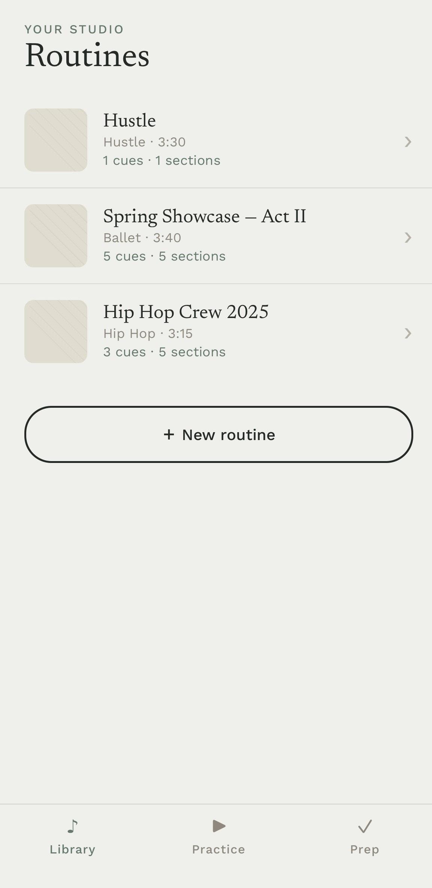
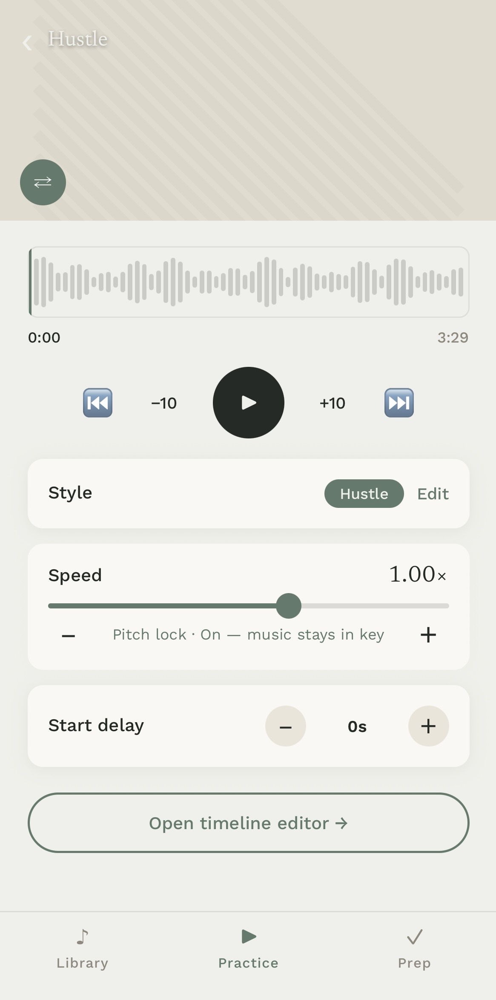
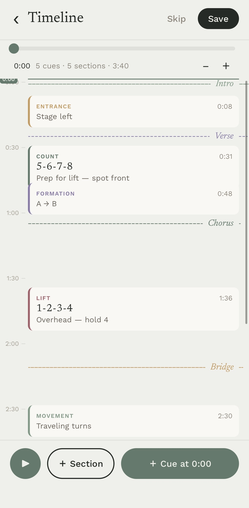

# Dancer Hub

> **Work in progress.** Core playback and timeline editing are functional; several features are still being built out.

A choreography practice app for dancers. Upload an audio track, mark sections and cues on a timeline, then rehearse with speed control and a configurable start delay so you have time to get into position before the music begins.

---

## Screenshots

| Library | Player | Timeline Editor |
|---|---|---|
|  |  |  |

---

## What works

- Upload audio and create a routine
- Timeline editor — add sections and cues, drag to retime
- Playback with speed control (0.25×–1.5×) and pitch lock
- Start delay (0–15s) to give time to get in position before music starts

## What's still in progress

- A-B loop (removed temporarily, being rebuilt)
- Video attachment and playback
- Task checklist
- Sharing / multi-user support
