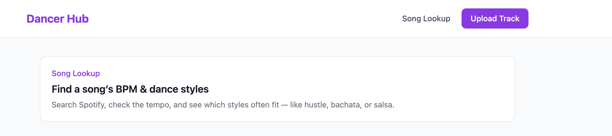
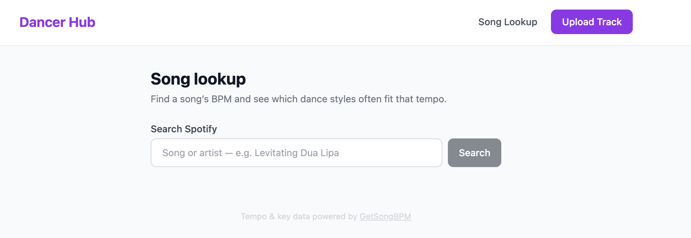
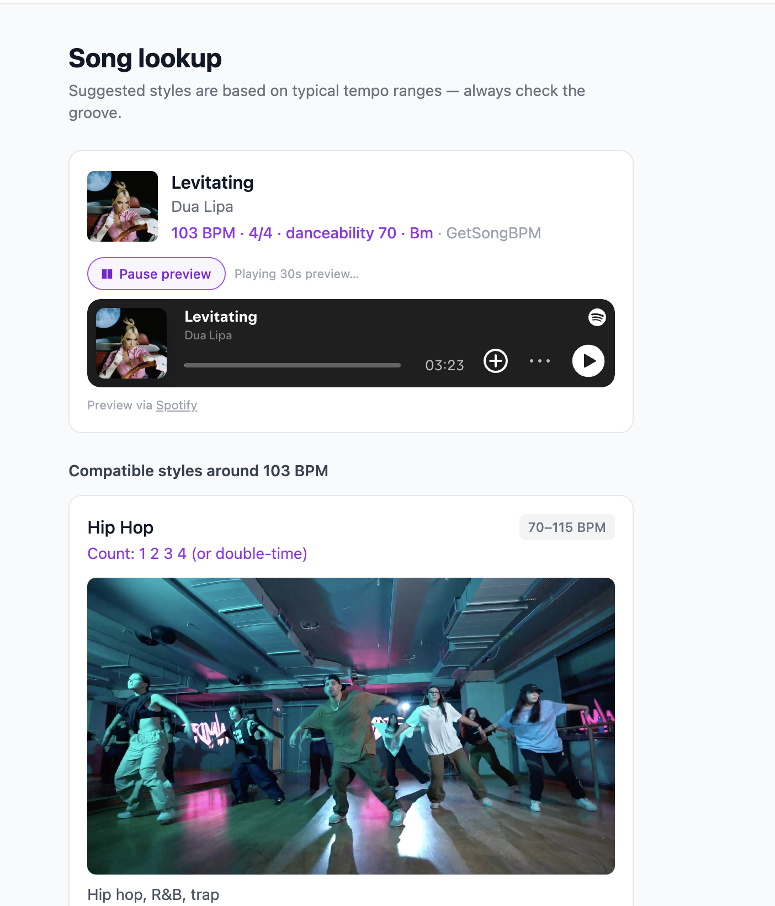

# Dancer Hub

> **Work in progress.** Core playback, timeline editing, and song lookup are functional; several features are still being built out.

A choreography practice app for dancers. Upload an audio track, mark sections and cues on a timeline, then rehearse with speed control and a configurable start delay so you have time to get into position before the music begins.

The web app also includes **Song Lookup**: search Spotify for a track, resolve its BPM, preview the audio, and see which dance styles often fit that tempo and groove.

---

## Screenshots

### Web

| Homepage | Song Lookup | Results |
|---|---|---|
|  |  |  |

## Mobile

| Library | Player | Timeline Editor |
|---|---|---|
|  |  |  |

---

## What works

### Practice / routines
- Upload audio and create a routine
- Timeline editor — add sections and cues, drag to retime
- Playback with speed control (0.25×–1.5×) and pitch lock
- Start delay (0–15s) to give time to get in position before music starts

### Song Lookup (`/lookup`)
- Search Spotify and pick a track (with in-app audio preview)
- Resolve BPM via cascading sources:
  1. **GetSongBPM** catalog
  2. **AcousticBrainz** (via MusicBrainz)
  3. **Preview analysis** (Deezer 30s clip → beat detection)
- Suggest compatible dance styles from curated tempo ranges, meter, and danceability
- Optional demos per style (drop MP4s into `apps/web/public/demos/` — see that folder’s README)

Style rules live in `packages/shared/src/danceStyles.ts`.

## What's still in progress

- A-B loop (removed temporarily, being rebuilt)
- Video attachment and playback
- Task checklist
- Sharing / multi-user support
- First-party dance style demo clips

---

## Monorepo layout

| Path | Role |
|---|---|
| `apps/web` | Next.js web app |
| `apps/api` | Express API (Spotify + tempo lookup) |
| `apps/mobile` | Expo mobile app |
| `packages/shared` | Shared types and dance-style matching |

---

## Local development

### Prerequisites
- Node.js 22+
- pnpm 9 (`packageManager` is pinned in root `package.json`)

### Install

```bash
pnpm install
```

### Environment

**API** — copy `apps/api/.env.example` → `apps/api/.env.local`:

```bash
PORT=4000
ALLOWED_WEB_ORIGIN=http://localhost:3000
SPOTIFY_CLIENT_ID=
SPOTIFY_CLIENT_SECRET=
GETSONGBPM_API_KEY=
```

**Web** — copy `apps/web/.env.example` → `apps/web/.env.local` and set `NEXT_PUBLIC_API_URL` (typically `http://localhost:4000`) plus any Supabase keys your setup uses.

### Run

In two terminals:

```bash
# API (required for Spotify search + BPM / style lookup)
cd apps/api && npm run dev

# Web
pnpm dev:web
```

- Web: [http://localhost:3000](http://localhost:3000)
- API: [http://localhost:4000](http://localhost:4000)
- Song Lookup: [http://localhost:3000/lookup](http://localhost:3000/lookup)

### Attribution

Tempo & key catalog data is powered by [GetSongBPM](https://getsongbpm.com) (attribution is shown in the UI where required).
