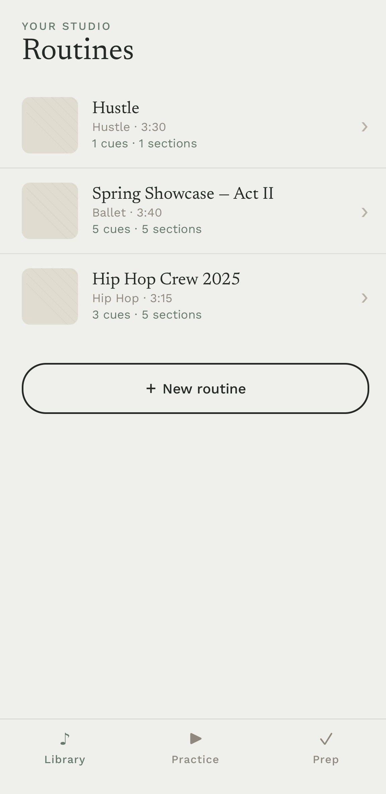
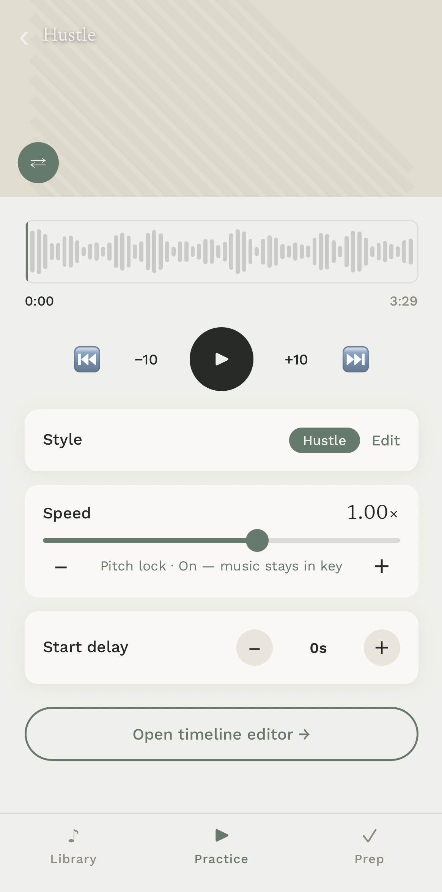
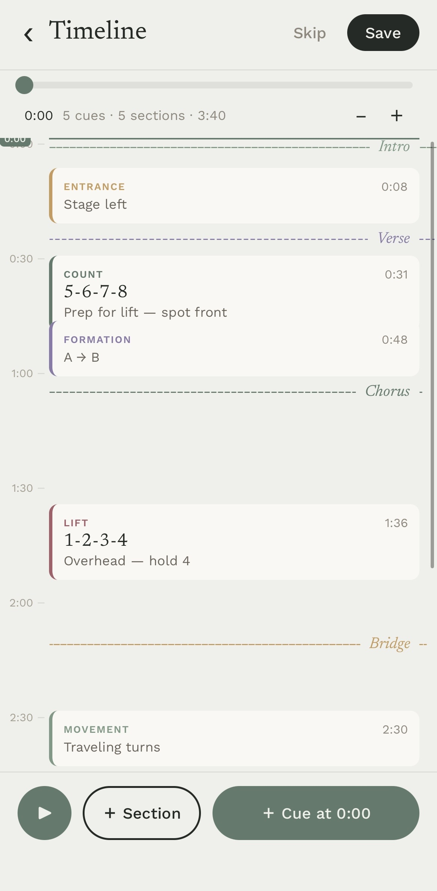

# Dancer Hub

A choreography practice app for dancers. Create a routine with audio and/or video, mark sections and cues on a timeline, then rehearse with speed control and a configurable start delay so you have time to get into position before the music begins.

The web app also includes **Song Lookup**: search Spotify for a track, resolve its BPM, preview the audio, and see which dance styles often fit that tempo and groove.

---

## Screenshots

### Web
| Home | Timeline Editor | Song Lookup |
|---|---|---|
|  |  |  |

More in [apps/web/README.md](apps/web/README.md).

### Mobile
| Library | Player | Timeline Editor |
|---|---|---|
|  |  |  |

More in [apps/mobile/README.md](apps/mobile/README.md).

---

## What works

### Practice / routines (`/routines`)
- Create a routine — attach audio and/or video (upload or record audio in-browser), pick a style, optionally search Spotify to pull BPM/key/artist metadata
- Timeline editor — add sections and cues, drag to retime
- Playback with speed control (0.25×–1.5×), pitch lock, and mirror flip for video
- Start delay (0–15s) to give time to get in position before music starts
- Home dashboard (`/`) surfaces recent routines and quick stats

### Song Lookup (`/lookup`)
- Search Spotify and pick a track (with in-app audio preview)
- Resolve BPM via cascading sources:
  1. **GetSongBPM** catalog
  2. **AcousticBrainz** (via MusicBrainz)
  3. **Preview analysis** (Deezer 30s clip → beat detection)
- Suggest compatible dance styles from curated tempo ranges, meter, and danceability

Style rules live in `packages/shared/src/danceStyles.ts`.

## What's still in progress

- A-B loop (schema exists, not implemented on either platform)
- Task / performance-prep checklist (mobile-only — see `apps/mobile/app/(tabs)/prep.tsx` — not yet on web)
- Sharing / multi-user support
- Per-style demo clips (removed pending licensed footage — shows a "Demo soon" placeholder for now)

---

## Monorepo layout

| Path | Role |
|---|---|
| `apps/web` | Next.js web app — see [apps/web/README.md](apps/web/README.md) |
| `apps/api` | Express API (Spotify + tempo lookup) |
| `apps/mobile` | Expo mobile app — see [apps/mobile/README.md](apps/mobile/README.md) |
| `packages/shared` | Shared types and dance-style matching |

---

## Local development

### Prerequisites
- Node.js 22+
- pnpm 9 (`packageManager` is pinned in root `package.json`)

### Install

```bash
pnpm install
```

### Environment

**API** — copy `apps/api/.env.example` → `apps/api/.env.local`:

```bash
PORT=4000
ALLOWED_WEB_ORIGIN=http://localhost:3000
SPOTIFY_CLIENT_ID=
SPOTIFY_CLIENT_SECRET=
GETSONGBPM_API_KEY=
```

**Web** — copy `apps/web/.env.example` → `apps/web/.env.local` and set `NEXT_PUBLIC_API_URL` (typically `http://localhost:4000`) plus any Supabase keys your setup uses.

### Run

In two terminals:

```bash
# API (required for Spotify search + BPM / style lookup)
cd apps/api && npm run dev

# Web
pnpm dev:web
```

- Web: [http://localhost:3000](http://localhost:3000)
- API: [http://localhost:4000](http://localhost:4000)
- Song Lookup: [http://localhost:3000/lookup](http://localhost:3000/lookup)


### Attribution

Tempo & key catalog data is powered by [GetSongBPM](https://getsongbpm.com) (attribution is shown in the UI where required).
