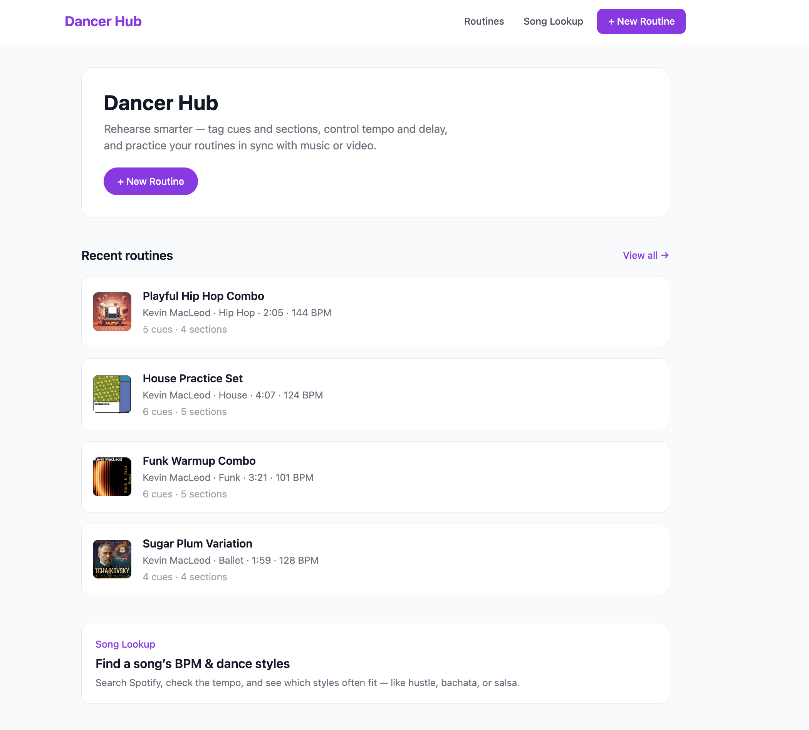
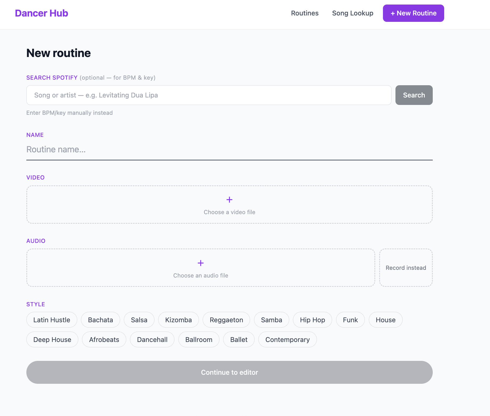
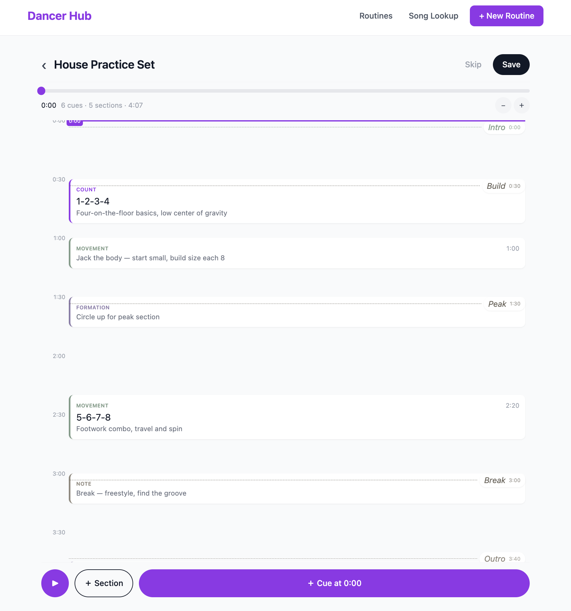
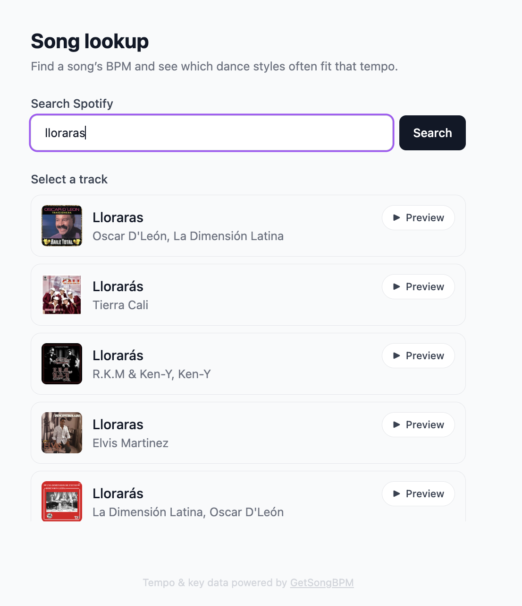
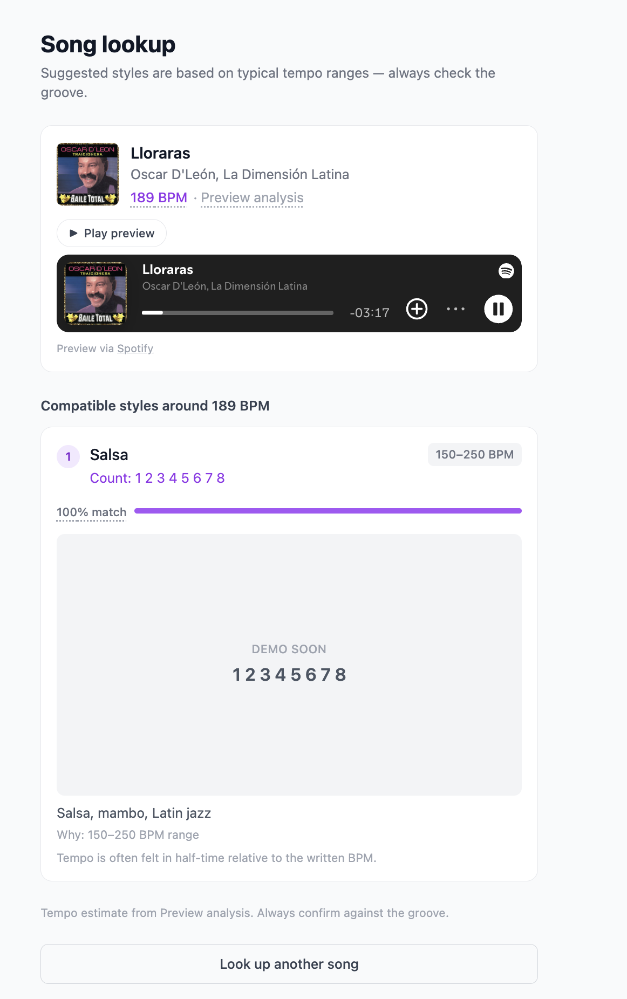

# Dancer Hub — Web

Next.js (App Router) web app for Dancer Hub — build routines with cues and sections, rehearse them with speed/pitch/delay control, and look up a song's BPM and compatible dance styles.

This app is part of the `dancer-hub` monorepo. For root-level setup (pnpm workspaces, `apps/api`, `apps/mobile`, `packages/shared`), see the [repo README](../../README.md).

---

## Screens

### Home dashboard (`/`)
Recent routines, quick stats, and a shortcut into Song Lookup.



### Routines (`/routines`, `/routines/new`, `/routines/[id]`, `/routines/[id]/edit`)
- Create a routine — attach audio and/or video (upload or record audio in-browser), pick a style, optionally search Spotify to pull BPM/key/artist metadata

  

- Timeline editor — add sections and cues, drag to retime

  

- Practice player — speed control (0.25×–1.5×), pitch lock, mirror flip for video, configurable start delay with countdown

### Song Lookup (`/lookup`)
Search Spotify for a track, resolve its BPM (GetSongBPM → AcousticBrainz → preview-analysis fallback chain), and see which dance styles fit that tempo, ranked by match.




### Sign in (`/login`, `/auth/callback`)
Magic-link (passwordless email) auth. Signed-out visitors can still browse everything, including practicing any routine; creating/editing a routine requires signing in. A handful of seeded example routines have no owner (`user_id IS NULL`) and are permanently public and read-only — shown with a "Demo" badge on the routine card and player, with the edit affordances hidden rather than just disabled.

---

## Structure

```
app/
  page.tsx                      Home dashboard
  layout.tsx                    Nav shell
  lookup/page.tsx                Song Lookup
  login/page.tsx                 Magic-link sign-in
  auth/callback/page.tsx         Parses the magic-link session, redirects
  routines/
    page.tsx                    Routine list
    new/page.tsx                 Create flow
    [id]/page.tsx                Practice player
    [id]/edit/page.tsx           Timeline editor (existing routine)

components/
  routines/                     Player, timeline editor, cue/section panels, recorder modal, etc.
  auth/AuthNavSlot.tsx            Sign in / sign out nav slot
  Tooltip.tsx, SpotifyPreviewButton.tsx, StyleDemo.tsx

lib/
  routineStore.tsx               Reducer + Context for practice/editor playback state
  routines.ts                    Supabase fetch helpers (routines + sections + cues)
  routineStyles.ts, routineTheme.ts
  mediaProbe.ts                  Browser-side audio/video duration probing
  attribution.ts                 CC-license credit lines for sourced audio
  api.ts                         Client for apps/api's track-metadata endpoint
  supabase.ts                    Supabase client (anon key, browser-side)
  useSession.ts                  Client hook wrapping Supabase auth state
```

Dance-style definitions and matching logic (`DANCE_STYLES`, `matchDanceStyles`) live in `packages/shared/src/danceStyles.ts`, shared with `apps/mobile`.

---

## Local development

### Prerequisites
- Node.js 22+, pnpm 9 (see root README)
- `apps/api` running locally — required for Spotify search and BPM/style lookups (both Song Lookup and the Routines create flow depend on it)

### Environment

Copy `.env.example` → `.env.local`:

```bash
NEXT_PUBLIC_SUPABASE_URL=
NEXT_PUBLIC_SUPABASE_ANON_KEY=
NEXT_PUBLIC_API_URL=http://localhost:4000
```

### Run

From the repo root:

```bash
# API (in another terminal)
cd apps/api && npm run dev

# Web
pnpm dev:web
```

Or from this directory: `npm run dev`. Runs at [http://localhost:3000](http://localhost:3000).

### Other scripts

```bash
npm run build        # production build
npm run start         # serve the production build
npm run type-check    # tsc --noEmit
npm run lint          # next lint
```

---

## Notes

- Auth is magic-link via Supabase, enforced with real row-level security — `routines`/`sections`/`cues` require `user_id = auth.uid()` to write, checked at the database, not just in the UI. Browsing (including practicing any routine) stays open to signed-out visitors; only creating/editing requires a session. `tasks`/`audio_tracks` (unused by this app) still have the old open `public_all` policy.
- For magic links to redirect correctly, the Supabase Dashboard's Authentication → URL Configuration → Redirect URLs must include `http://localhost:3000/auth/callback` (and your deployed origin's equivalent) — otherwise `emailRedirectTo` is silently ignored.
- Supabase's default email sending has a fairly low rate limit (shared relay, meant for dev/testing) — expect to hit it if you're sending yourself several magic links in a short window. Configure custom SMTP in the dashboard before relying on this for real users.
- Routine audio/video is stored in the `audio-tracks` / `video-tracks` Supabase Storage buckets (public buckets, upload-only policy for the anon key — no delete policy is configured yet).
- Some example routines are seeded with audio from [Kevin MacLeod / Incompetech.com](https://incompetech.com) under [CC BY 4.0](https://creativecommons.org/licenses/by/4.0/) — attribution is shown on the practice player for any routine using that audio.
